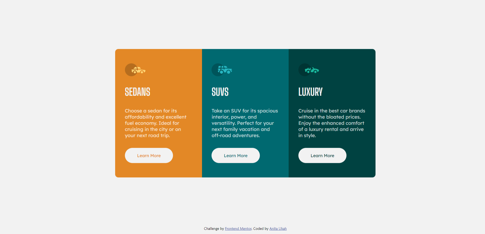

# Frontend Mentor - 3-column preview card component solution

This is a solution to the [3-column preview card component challenge on Frontend Mentor](https://www.frontendmentor.io/challenges/3column-preview-card-component-pH92eAR2-). Frontend Mentor challenges help you improve your coding skills by building realistic projects. 

## Table of contents

- [Overview](#overview)
  - [The challenge](#the-challenge)
  - [Screenshot](#screenshot)
  - [Links](#links)
- [My process](#my-process)
  - [Built with](#built-with)
  - [What I learned](#what-i-learned)
  - [Continued development](#continued-development)
  - [Useful resources](#useful-resources)
- [Author](#author)
- [Acknowledgments](#acknowledgments)

**Note: Delete this note and update the table of contents based on what sections you keep.**

## Overview

### The challenge

Users should be able to:

- View the optimal layout depending on their device's screen size
- See hover states for interactive elements

### Screenshot



### Links

- Solution URL: [Add solution URL here](https://your-solution-url.com)
- Live Site URL: [Add live site URL here](https://neetauka.github.io/3-column-preview-card/)

## My process

### Built with

- Semantic HTML5 markup
- CSS custom properties
- Flexbox
- Mobile-first workflow
- [Javascript]- Vanilla javascript

**Note: These are just examples. Delete this note and replace the list above with your own choices**

### What I learned

i learnt how to center an element inside a document. i also learnt how to use flex-flow to structure properly the tags in a card just in the project. i learnt how to dynamically display contents using javascript


```css
.container{
display:flex;
align-items: center;
justify-content: center;
width:100%;
min-height: 100vh;   
}

.box{
  max-width: 270px;
  height:400px;
  box-sizing: border-box;
  display:flex;
  flex-flow: column wrap;
  justify-content: space-around;
  align-items:flex-start;
  padding:30px;
  border:none;
  /* padding:40px; */
}
```
```js
window.addEventListener('DOMContentLoaded', function () {
    let displayColumn = card.map(function (item) {
        // console.log(item);

        return `<div class="box">

        

        <h1>${item.header}</h1>

        <p>
          ${item.text}
        </p>

        <button class=${item.class}>
           ${item.buttonText}
        </button>
      </div>`;
    });
    displayColumn = displayColumn.join("");
    container.innerHTML = displayColumn;

})

```

### Continued development

i want to continue to learn how to properly use flex flow in aligning items in a card. i want to also learn how to use other javascript method to dynamically manipulate the DOM.
**Note: Delete this note and the content within this section and replace with your own plans for continued development.**

### Useful resources


## Author

- Website - [Add your name here](https://www.your-site.com)
- Frontend Mentor - [@neetauka](https://www.frontendmentor.io/profile/neetauka)
- Twitter - [@anitauka3](https://www.twitter.com/anitauka3)

**Note: Delete this note and add/remove/edit lines above based on what links you'd like to share.**

## Acknowledgments

my shout out goes to the Holy spirit who gave me the idea to use javascript and alter the display of the cards. i also want to lowkey thank freecodecamp for the video "15 javascript projects". That was where i learnt the javascript code i used in the project.


**Note: Delete this note and edit this section's content as necessary. If you completed this challenge by yourself, feel free to delete this section entirely.**